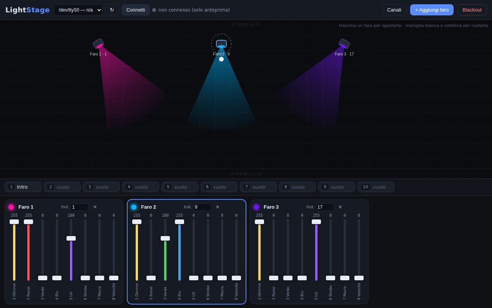

# LightStage

Software essenziale per programmare fari DMX (pensato per fari **UkFog UV+RGB a
8 canali**) tramite un cavo **USB→DMX**. Un'alternativa minimale a SweetLight /
Daslight: solo quello che serve.



## Cosa fa

- **Fari**: aggiungi un faro con nome, indirizzo DMX e **8 o 16 canali**: per
  ognuno hai un fader (0–255). Ogni faro ha i **suoi** nomi e ruoli dei canali
  (pulsante ⚙ sulla scheda), quindi puoi mescolare par, teste mobili e altro
  nello stesso show; aggiungendo un faro puoi copiare i canali da uno già
  configurato. Il pulsante *"Crea 8 fari"* prepara in un clic la
  configurazione tipica UkFog con indirizzi 1, 9, 17, … 57.
- **Selettore colore**: in ogni scheda c'è un quadratino colorato: scegli un
  colore e i fader Rosso/Verde/Blu si impostano da soli (e se il dimmer è a
  zero viene alzato, così il colore si vede subito). Muovendo i fader a mano,
  il selettore si aggiorna di conseguenza.
- **Preset**: **100 slot** con nome. Clic su uno slot vuoto per salvare le luci
  attuali, clic su uno pieno per caricarlo, 💾 per sovrascrivere/rinominare,
  ✕ per svuotarlo. Il selettore **Fade** applica una dissolvenza nel passaggio
  da un preset all'altro.
- **Preset grid**: il pulsante in basso a destra (o il tasto **G**) apre la
  schermata con tutti i 100 preset in griglia da 5 colonne, ognuno con
  l'anteprima del palco e il suo nome, per ritrovare al volo la scena giusta.
  Nella griglia il preset **in onda** ha il bordo verde; cliccandone un altro
  lo si *prepara* (bordo rosso lampeggiante) e va in onda solo con la **barra
  spaziatrice**, come su una console. Il pulsante **⧉** su un preset lo
  **duplica**: si sceglie il nome della copia e in quale dei 100 spazi metterla.
  Con **FTB** o **Blackout** attivi il preset in onda diventa **giallo
  lampeggiante** (targhetta *AL BUIO*) con l'anteprima quasi spenta: si vede
  sempre qual è la scena caricata. Al buio si può anche cambiare scena — clic
  e barra spaziatrice — senza interrompere l'FTB: le teste si riposizionano
  subito e le luci salgono su quella scena quando si toglie l'FTB.
- **Copione**: il pulsante 📜 in basso a destra (o il tasto **C**) apre la
  schermata del copione. Dentro si creano più **progetti**; ognuno ha il
  **PDF del copione** a destra, sfogliabile come in Anteprima, e a sinistra una
  **timeline** alta quanto il copione, che scorre insieme alle pagine. Un clic
  sulla linea inserisce un preset nel punto voluto (quanti se ne vuole): resta
  ancorato a quel passaggio del testo, con una **miniatura del palco** grande
  quanto la colonna e il nome sotto, e si può **trascinare** su e giù per
  spostarlo. Il pallino resta sempre nel punto esatto scelto: se due preset
  sono troppo vicini l'anteprima scivola sopra o sotto ed è collegata al suo
  pallino da una linea di richiamo. In basso si vede
  l'anteprima del preset **in onda** e di quello **pronto**: clic su un preset
  della timeline lo prepara, la **barra spaziatrice** lo manda in onda. La ✕ sul
  preset lo toglie dal copione. In alto a destra ci sono **FTB** e **Blackout**
  con le loro durate, come nella Preset grid. Il PDF sta nella cartella `copioni/` (nella versione web, nel
  browser).
- **Come entra un preset**: ogni preset porta con sé la **durata della
  dissolvenza** con cui entra (0 / 0,5 / 1 / 1,5 s; 0 = cambio netto) e se le
  **teste mobili si spostano accese o al buio**. I comandi sono gli stessi
  ovunque: a sinistra di ogni anteprima nella Preset grid, sul bordo
  dell'anteprima nel Copione, e accanto al palco — lì valgono per il prossimo
  preset che salvi. Con le teste **al buio** le luci scendono, il movimento va
  in posizione al buio, si lascia il tempo alle teste di arrivare e poi le luci
  risalgono sulla nuova scena. Riguarda **solo le teste mobili**: gli altri fari
  cambiano scena normalmente, con il loro fade.
- **Durante lo spettacolo tieni la finestra in primo piano** (versione web):
  quando la pagina finisce in secondo piano il browser rallenta di molto ciò
  che sta girando, e senza segnale DMX i fari possono ripartire con il loro
  programma interno. LightStage si difende (i tempi dell'invio li scandisce un
  worker e la pagina resta "sveglia" finché il cavo è collegato) e avvisa in
  alto se il browser lo sta frenando comunque. La versione Python non ha
  questo problema: l'invio DMX gira nel programma, non nel browser, quindi puoi
  ridurre a icona la finestra — basta non chiudere quella del lanciatore.
- **Su tablet e telefono** non c'è la barra spaziatrice: in fondo alla Preset
  grid e al Copione compare un pulsante verde **GO**, che manda in onda il
  preset preparato. Sui computer resta nascosto.
- Il preset su cui stai lavorando resta evidenziato anche mentre ne cambi le
  luci: la targhetta diventa *MODIFICATO* finché non lo salvi con 💾.
- **Passaggio fra le schermate**: in fondo a ogni schermata ci sono i pulsanti
  per andare alle altre due (Principale, Preset grid, Copione); **Esc** torna
  sempre alla schermata principale.
- **Scorciatoie da tastiera** (legenda sempre visibile nel piè di pagina):
  **1–9 e 0** lanciano i preset, **B** blackout, **F** fade to black,
  **N** nuovo faro, **G** griglia preset, **C** copione, **Cmd/Ctrl+C**
  connetti il cavo, **Cmd/Ctrl+S** salva lo show (nella versione web salva il
  setup online, altrimenti scarica il file), **Cmd/Ctrl+O** apre la finestra
  Online (solo versione web).
- **Duplica un faro**: il pulsante ⧉ sulla scheda crea una copia con gli stessi
  canali, le stesse luci e la stessa direzione, sul primo indirizzo DMX libero
  e con il nome che avanza (Par 1 → Par 2). Nome e indirizzo si correggono poi
  direttamente sulla scheda.
- **Portare lo show da una versione all'altra**: **Esporta** scarica un file con
  fari, canali, posizioni, luci e preset; **Importa** lo carica. I due pulsanti
  ci sono in entrambe le versioni, quindi si passa dalla versione web a quella
  con il cavo (e viceversa) in due clic. I PDF dei copioni non entrano nel file:
  i progetti passano, il testo va ricaricato dove serve.
- **Più fari insieme**: clic sul primo faro, poi **Maiusc**+clic sugli altri
  (sulla mappa o sulle schede dei fader). Da quel momento un fader, il
  selettore colore e il mirino agiscono su **tutti** i fari scelti; il mirino
  in particolare li punta sullo stesso punto del palco, ognuno dalla sua
  posizione. Si possono unire solo fari con gli **stessi canali** (un par e una
  testa mobile no). Maiusc+clic su un faro già scelto lo toglie, un clic sul
  palco vuoto azzera la scelta.
- **Anteprima palco**: vista dall'alto del palco. Trascina i fari per
  posizionarli, ruotali con la maniglia bianca (o con la rotellina del mouse)
  per orientare il fascio. Il colore e l'intensità del fascio seguono i fader
  (RGB + UV reso come viola).
- **Teste mobili nell'anteprima**: la direzione in cui orienti un faro sulla
  mappa diventa il suo **zero**; da lì il canale **pan** fa ruotare il fascio
  (fino a 540°, come su un wash) e il canale **focus** ne apre l'angolo da
  **10° a 60°**. Ri-orientando il faro sulla mappa lo zero si riposiziona sul
  valore di pan in quel momento.
- **Puntamento col mirino**: seleziona un faro con il pan e accanto a esso
  compare un mirino, sempre dalla parte opposta al fascio (così la luce non lo
  copre mai). Cliccalo (il puntatore diventa una croce), poi clicca il
  punto del palco da illuminare: si spostano da soli sia il **pan** (la
  direzione, col movimento più corto) sia il **tilt** (l'inclinazione, se la
  testa ce l'ha). Lo **zero non cambia**, quindi il faro resta orientato com'era
  sulla mappa. **Esc** annulla il puntamento.
- **Il palco in tre dimensioni**: perché il tilt sia giusto servono due misure,
  in basso a sinistra sulla mappa: **quanto è grande il palco** (larghezza ×
  profondità in metri) e se la luce deve arrivare **a terra o sui volti**
  (1,6 m). Ogni testa mobile ha poi la sua **altezza da terra** (campo `H`
  sulla scheda dei fader). Con questi tre numeri la distanza tra faro e
  bersaglio è nota, e l'inclinazione viene da sé: `tilt = atan(distanza /
  altezza)`. Sulla mappa il fascio non è più un cono lungo a caso: si vede la
  **pozza di luce** dove la luce tocca davvero il pavimento, allungata come
  nella realtà quando il fascio arriva di sbieco.
- **Taratura sui quattro angoli** (pulsante *Tara le teste*, in basso a
  sinistra sulla mappa): il modo completo di far imparare il palco al
  programma. Parte un giro guidato: punti a mano tutte le teste sull'angolo del
  pavimento che ti indica (sulla mappa lampeggia quello giusto), premi *Segna
  l'angolo*, e così per i quattro angoli. Da quelle otto misure per testa
  LightStage ricava da sé **dove sta ogni testa, quanto è alta, i suoi due zeri
  e da che parte gira** pan e tilt — comprese le teste appese a testa in giù,
  che girano al contrario. È lo stesso conto che in topografia si chiama
  *resezione*: si conoscono i punti guardati e con che angoli li si guarda, si
  cerca da dove li si guarda.
  Alla fine ti dice, testa per testa, di quanto sbaglierebbe il fascio ai
  quattro angoli con i valori trovati: **sotto i 30 cm** la taratura è buona e
  te la propone, sopra la segna in giallo e la lascia da parte (quasi sempre
  vuol dire che quella testa non era puntata proprio sull'angolo: basta rifare
  il giro per lei). Le misure restano salvate, così se poi correggi le
  dimensioni del palco il conto si rifà da solo.
- **Taratura veloce di una sola testa** (pulsante ⌖ sulla sua scheda): se ne hai
  urtata una e devi solo rimetterle gli zeri, punta la testa a mano dove vuoi,
  premi ⌖ e clicca sulla mappa il punto che sta illuminando. Da quel solo punto
  ricava lo zero del pan e quello del tilt, dando per buone posizione e altezza
  che già conosce.
- **Uscita DMX**: il segnale viene inviato in continuo (~30 fps) sul cavo
  USB-DMX. C'è un pulsante **Blackout** (spegne tutto all'istante senza
  perdere i valori dei fader, tasto **B**) e un pulsante **FTB** — *fade to
  black*, tasto **F** — che funziona da interruttore: al primo clic spegne
  gradualmente (0 / 0,5 / 1 / 1,5 secondi a scelta) e resta **rosso
  lampeggiante**; al secondo clic riaccende le luci com'erano, in dissolvenza.
  Sia FTB sia Blackout agiscono **solo sul dimmer**: colori, strobo e posizione
  restano dove sono, così alla riaccensione la scena è identica. I fari senza
  canale dimmer, che altrimenti resterebbero accesi, spengono i colori.
  Pan/Tilt/Focus delle teste mobili non si muovono mai.
- **Salvataggio automatico**: fari, posizioni, preset e configurazione canali
  vengono salvati da soli nel file `show.json`.

## Requisiti

- Python 3.9 o superiore
- Un cavo USB→DMX basato su chip **FTDI** (protocollo *Open DMX*: è il tipo più
  comune, ad es. Enttec Open DMX USB e la maggior parte dei cavi economici).

## Avvio con doppio clic (senza terminale)

Nella cartella del progetto trovi tre lanciatori — usa quello del tuo sistema:

| Sistema | File da avviare |
|---------|-----------------|
| Windows | `Avvia LightStage.bat` |
| macOS   | `Avvia LightStage.command` *(al primo avvio: clic destro → Apri)* |
| Linux   | `avvia-lightstage.sh` |

Alla prima esecuzione installano da soli le dipendenze (serve solo Python 3
già installato), poi avviano il programma e aprono il browser. Per chiudere
LightStage basta chiudere la finestra del lanciatore.

Puoi creare un collegamento sul desktop: tasto destro sul file →
*Invia a → Desktop* (Windows) o *Crea alias* (macOS).

## Avvio da terminale

```bash
pip install -r requirements.txt
python lightstage.py
```

Il browser si apre da solo su <http://127.0.0.1:8123>. Senza cavo collegato
l'app funziona comunque: fader, preset e anteprima restano attivi (utile per
preparare lo spettacolo a casa).

## Usarlo da telefono, tablet o altri computer

Il computer col cavo USB-DMX fa da "centralina": LightStage è un piccolo sito
web servito da lì a **tutta la rete locale**. Dagli altri dispositivi
(collegati alla **stessa rete Wi-Fi**) apri nel browser l'indirizzo che trovi:

- nel pulsante **📱 In rete** in alto nell'interfaccia, oppure
- nel terminale all'avvio (riga *"Da telefoni/PC sulla stessa rete"*),
  ad es. `http://192.168.1.42:8123`.

Tutti i dispositivi restano sincronizzati **in tempo reale** (meno di mezzo
secondo): il computer in regia resta collegato al cavo DMX e comanda le luci,
mentre da iPad o telefono muovi i fader, lanci i preset, aggiungi fari o
sposti i fari sulla mappa — ogni modifica compare subito anche sugli altri
schermi. Chi sta manovrando un fader ha la precedenza, così due persone non
si contendono lo stesso comando. Al primo avvio **Windows** chiede se
consentire a Python l'accesso alla rete: scegli *Consenti* (reti private).

Nota: il programma deve girare sul computer fisicamente collegato al cavo
DMX — un sito su internet non potrebbe raggiungere il cavo USB. Se ti serve
il controllo da **fuori** dalla rete locale (da casa verso la sala, ecc.),
il modo più semplice e sicuro è una VPN tipo [Tailscale](https://tailscale.com)
sui due dispositivi: l'indirizzo resta lo stesso e funziona ovunque.
Chiunque sia sulla stessa rete può controllare le luci: su reti pubbliche
tienilo a mente.

## Versione sito web (usarlo da qualsiasi computer)

Nella cartella `webapp/` c'è una **versione che gira interamente nel browser**,
senza installare niente: si apre il sito, si collega il cavo USB-DMX al
computer che si sta usando e si preme *Connetti cavo*. Usa l'API **Web
Serial**, quindi serve **Chrome o Edge** (Firefox e Safari non la supportano).

- Fari, preset e posizioni vengono salvati **nel browser di quel computer**
  (localStorage). Con **Esporta/Importa** puoi portare tutto su un altro
  computer come file `lightstage-show.json`.
- Con **☁ Online** puoi salvare lo show su un tuo **foglio Google** e
  ricaricarlo da qualsiasi computer con un codice tipo `K7TQ-M2XP`. Serve una
  configurazione una tantum di ~5 minuti:
  [istruzioni](webapp/apps-script/ISTRUZIONI.md).
- Per pubblicarla gratis con GitHub Pages: *Settings → Pages → Deploy from a
  branch*, scegli il branch e la cartella `/ (root)`. Il sito sarà su
  `https://<utente>.github.io/Lightstage/webapp/`.
- Durante lo spettacolo tieni la scheda del browser **in primo piano**: le
  schede in secondo piano vengono rallentate e il segnale DMX perde fluidità.

La versione Python (sopra) resta quella consigliata per l'uso fisso: funziona
con qualsiasi browser, salva su file e permette il controllo da più
dispositivi in contemporanea sulla rete locale.

## Collegare i fari (catena DMX)

Il DMX è un bus: **tutti i fari restano collegati contemporaneamente**, in
cascata, e ricevono tutti lo stesso segnale. Ogni faro legge solo i suoi 8
canali in base all'indirizzo impostato sul suo display:

```
Computer ── cavo USB-DMX ──▶ Faro 1 (ind. 1) ──▶ Faro 2 (ind. 9) ──▶ … ──▶ Faro 8 (ind. 57)
                              DMX IN → DMX OUT    DMX IN → DMX OUT
```

Ogni faro si collega al successivo con un cavo DMX/XLR da *DMX OUT* a
*DMX IN*. Sull'ultimo faro è buona pratica (non obbligatoria su tratte corte)
mettere un terminatore DMX da 120 Ω.

Con delle **trasmittenti/riceventi DMX wireless** lo schema è identico: la
trasmittente si collega all'uscita XLR del cavo USB-DMX (non al computer) e
le riceventi si mettono davanti ai fari, che possono comunque essere
concatenati tra loro dopo ogni ricevente.

## Collegare il cavo USB-DMX

1. Collega il cavo, avvia LightStage e scegli la porta dal menu in alto
   (di solito viene riconosciuta da sola: `COM3` su Windows,
   `/dev/ttyUSB0` su Linux, `/dev/tty.usbserial-…` su macOS).
2. Premi **Connetti**: il pallino diventa verde e il DMX esce dal cavo.

**Windows**: se la porta non compare, installa i driver FTDI VCP
(<https://ftdichip.com/drivers/vcp-drivers/>).

**Linux**: serve il permesso sulla porta seriale:

```bash
sudo usermod -a -G dialout $USER   # poi scollegati e riaccedi
```

### Problemi di connessione

- **"write timeout" / "la porta non accetta dati"**: hai selezionato una porta
  che non è il cavo DMX (una seriale interna tipo `COM1`/`/dev/ttyS0` o una
  porta Bluetooth). Nel menu scegli la voce contrassegnata con ● *(probabile
  cavo DMX)*: di solito si chiama "USB Serial Port (COMx)" su Windows,
  `/dev/ttyUSB0` su Linux, `/dev/cu.usbserial-…` su macOS. Se non compare
  nessuna porta USB, il cavo non viene riconosciuto: su Windows installa i
  driver FTDI VCP; se il cavo è di tipo **uDMX** non appare come porta
  seriale e al momento non è supportato.
- **"Permission denied" (Linux)**: aggiungi l'utente al gruppo `dialout`
  (comando più sotto) e riaccedi.
- **"Access is denied" / porta occupata**: un altro programma sta usando la
  porta: chiudilo e ripremi Connetti.

## Canali dei fari UkFog

L'indirizzo impostato sul faro (display/dip-switch) deve coincidere con quello
inserito nell'app. Layout predefinito dei canali (quello tipico dei par
UV+RGB a 8 canali):

| CH | Funzione | CH | Funzione |
|----|----------|----|----------|
| 1  | Dimmer   | 5  | UV       |
| 2  | Rosso    | 6  | Strobo   |
| 3  | Verde    | 7  | Macro    |
| 4  | Blu      | 8  | Velocità |

Se il tuo modello usa un ordine diverso — o hai fari di tipo differente —
premi il **⚙ sulla scheda del faro** e correggi nomi e ruoli dei suoi canali.
I ruoli disponibili sono: **Dimmer, Rosso, Verde, Blu, UV, Bianco, Strobo,
Pan, Tilt, Focus, Return, Altro**. Il ruolo serve all'anteprima per calcolare
il colore del fascio e al selettore colore per capire dove sono i canali RGB
(in qualunque posizione siano). *"Salva per tutti i fari"* applica il layout
a tutti i fari con lo stesso numero di canali. L'uscita DMX non dipende dai
ruoli: manda sempre il fader N sul canale indirizzo+N-1.

Quando aggiungi un faro scegli fra tre possibilità: canali **predefiniti
UkFog**, **come un faro esistente**, oppure **nuovo set di canali** da
comporre subito lì (per ogni canale scegli il ruolo e il nome si compila da
solo). Esempio, una testa mobile a 8 canali:

| CH | Nome  | Ruolo | CH | Nome   | Ruolo  |
|----|-------|-------|----|--------|--------|
| 1  | Pan   | Pan   | 5  | Verde  | Verde  |
| 2  | Tilt  | Tilt  | 6  | Blu    | Blu    |
| 3  | Focus | Focus | 7  | Bianco | Bianco |
| 4  | Rosso | Rosso | 8  | Return | Return |

## Versione

Il numero di versione è in basso a destra nell'interfaccia; lo storico delle
modifiche è in [CHANGELOG.md](CHANGELOG.md). Due cifre soltanto: il primo
numero cambia con le modifiche strutturali, il secondo con aggiunte e
ritocchi.

**Non vedi le ultime modifiche?** Controlla il numero in basso a destra: se
non è quello dell'ultima versione, il browser sta usando la copia vecchia —
ricarica con **Ctrl+F5** (Cmd+Shift+R su Mac). Se usi la versione Python,
ricordati di aggiornare la cartella con `git pull` e riavviare il programma.

Per rilasciare una versione nuova: cambia `APP_VERSION` in `static/app.js`,
il `?v=` in `static/index.html`, `webapp/index.html` e `index.html` (serve a
non far riusare al browser i file della versione precedente) e il numero in
`webapp/version.json` (è quello che fa comparire l'avviso di aggiornamento).

## Limitazioni

- Un solo universo DMX (512 canali), più che sufficiente per 8 fari.
- Supporta il protocollo *Open DMX* (seriale FTDI). Le interfacce **uDMX** e
  **Enttec DMX USB Pro** usano protocolli diversi e per ora non sono
  supportate.
- Se due fari hanno indirizzi sovrapposti l'app lo segnala in rosso e sul
  canale condiviso vince il valore più alto (merge HTP).
